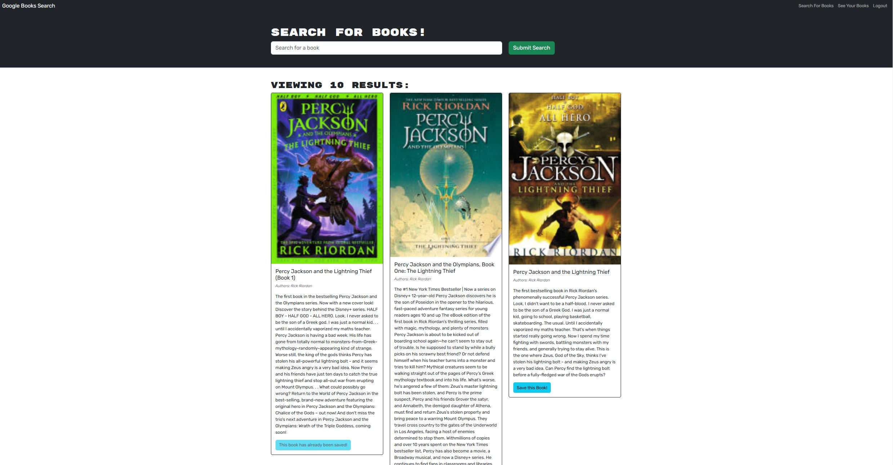
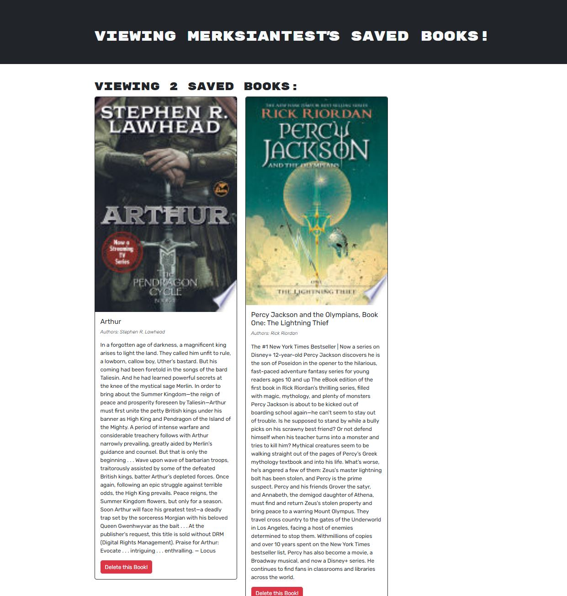

# MERN_GraphQL_Refactor

## Description
An existing app that has been refactored to utilize a GraphQL layer and a MongoDB database. Using the Google Books API, you can search, save, and delete books for your personal read list.



## Usage
You can access the app at the following link: [https://mern-graphql-refactor-3gat.onrender.com](https://mern-graphql-refactor-3gat.onrender.com)  
Login with a username, password, and email. Then search for available books to add to your own read list. *Upon clicking the link, the browser may take more time than usually expected.*



## Installation
```sh
npm install
npm run build
npm run develop
```

## Credits & How to Contribute
This app was refactored by Mark Sianipar. Please contact me on GitHub at Marksian with any questions or requests.

